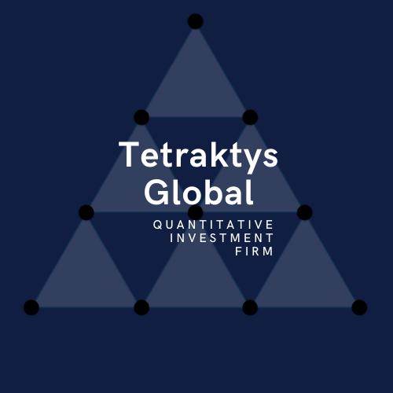

# Hi!  I'm the founder of Tetraktys Global. 

## Tetraktys Global seeks to continuously produce high-quality trading signals (alphas) through our proprietary research platform Alpha-Bets. We develop and deploy systematic investment strategies focused on market inefficiencies across a variety of asset classes and global markets.

## I'm always looking for collaborators interested in AI and ML for trading. 

<!--
**johncousins/johncousins** is a ✨ _special_ ✨ repository because its `README.md` (this file) appears on your GitHub profile.

Here are some ideas to get you started:

- 🔭 I’m currently working on ...
- 🌱 I’m currently learning ...
- 👯 I’m looking to collaborate on ...
- 🤔 I’m looking for help with ...
- 💬 Ask me about ...
- 📫 How to reach me: ...
- 😄 Pronouns: ...
- ⚡ Fun fact: ...
-->
